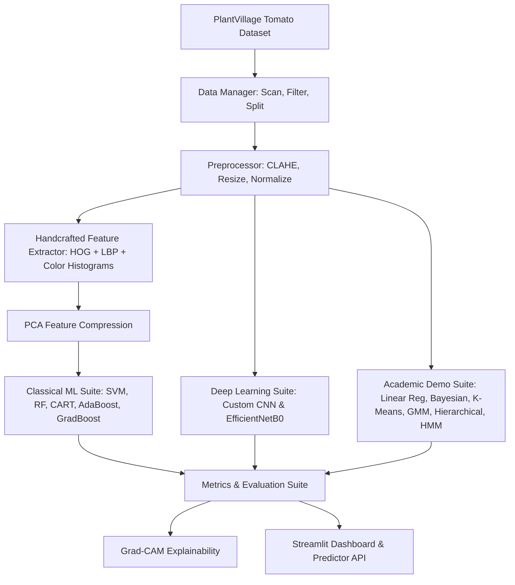

# 🍅 AI-Based Tomato Leaf Disease Detection
### End-to-End Machine Learning & Deep Learning Pathology Classification Pipeline

[](https://www.python.org/)
[](https://www.tensorflow.org/)
[](https://scikit-learn.org/)
[](https://opencv.org/)
[](https://streamlit.io/)
[](LICENSE)

---

## 📌 Executive Summary

This repository presents a **production-quality, modular, end-to-end Machine Learning and Deep Learning system** for detecting and classifying **10 tomato leaf disease states** (9 disease categories + 1 healthy control) using the PlantVillage dataset.

The system combines **classical feature engineering** (HOG, LBP, Color Histograms) and **traditional classifiers** (SVM, Random Forest, AdaBoost, Gradient Boosting, Decision Trees) with **modern deep learning architectures** (Custom CNNs and Transfer Learning via EfficientNetB0). Additionally, it provides **academic demonstration modules** for Linear Regression, Bayesian Logistic Regression, K-Means, GMM, Hierarchical Clustering, and Hidden Markov Models (HMM) to satisfy university course requirements without compromising production pipeline integrity.

---

## 📸 Key Features & Capabilities

- **10-Class Single-Crop Focus**: Targeted specifically at tomato pathology (16,012 images) for high fine-grained diagnostic precision.
- **Hybrid Multi-Paradigm Pipeline**: 
  - **Feature Extractor**: HOG (structure) + LBP (texture) + HSV Color Histograms + PCA dimensionality reduction.
  - **Classifiers**: Support Vector Machine (RBF kernel), Random Forest, Custom Deep CNN, and Transfer Learning (EfficientNetB0).
  - **Academic Demos**: Linear Regression (severity estimation), Bayesian Logistic Regression, K-Means, GMM, Hierarchical Clustering (dendrograms), and HMM (spatial raster scanlines).
- **Explainable AI (XAI)**: Grad-CAM activation heatmaps overlaid on leaf images for transparent diagnostic reasoning.
- **Interactive Web App**: Full-featured Streamlit dashboard for drag-and-drop image inference, class probability charts, and disease management advice.
- **Reproducible Architecture**: Fully driven by a single `config/config.yaml` file with global random seeding and structured logging.

---

## 📁 Repository Directory Structure

```text
ML END SEMESTER PROJECT 2026/
├── config/
│   └── config.yaml               # Central YAML configuration driving all modules
├── docs/
│   ├── DESIGN_IMPROVEMENTS.md    # Technical review & design decisions document
│   ├── INSTALLATION.md           # Step-by-step setup guide
│   ├── EXECUTION_GUIDE.md        # CLI & phase execution commands
│   ├── ARCHITECTURE_DIAGRAMS.md  # System, Data Flow, and Pipeline diagrams
│   ├── PROJECT_REPORT.md         # Comprehensive academic technical report
│   └── PRESENTATION_SLIDES.md    # Presentation deck blueprint
├── src/
│   ├── data/                     # Dataset loading, filtering, scanning, splitting
│   ├── preprocessing/            # Resizing, normalization, CLAHE contrast tuning
│   ├── features/                 # HOG, LBP, Color Histograms, PCA reduction
│   ├── models/
│   │   ├── classical/            # SVM, Random Forest, CART, AdaBoost, GradBoost, Bayesian
│   │   ├── clustering/           # K-Means, GMM, Hierarchical Clustering
│   │   ├── sequential/           # Spatial Scanline Hidden Markov Model
│   │   └── deep_learning/        # Custom CNN, EfficientNetB0, Grad-CAM
│   ├── evaluation/               # Metrics calculator & publication visualizer
│   ├── deployment/               # Predictor API & TFLite model exporter
│   └── utils/                    # Logger, random seed setter, common I/O helpers
├── scripts/                      # Runnable phase entry points
│   ├── run_dataset.py
│   ├── run_preprocessing.py
│   ├── run_features.py
│   ├── run_classical_ml.py
│   ├── run_demos.py
│   ├── run_deep_learning.py
│   ├── run_evaluation.py
│   └── predict.py
├── app/
│   └── streamlit_app.py          # Streamlit web application dashboard
├── notebooks/                    # Jupyter notebooks for interactive exploration
│   ├── 01_exploratory_data_analysis.ipynb
│   └── 02_model_benchmarking.ipynb
├── artifacts/                    # Auto-generated outputs (git-ignored model weights/logs)
│   ├── models/
│   ├── figures/
│   ├── reports/
│   └── logs/
├── main.py                       # Unified pipeline orchestrator CLI
├── requirements.txt              # Dependency specification
└── README.md                     # Project overview (this document)
```

---

## 📊 Dataset Overview (PlantVillage Tomato Subset)

The dataset consists of **16,012 images** across 10 tomato categories:

| Class Name | Common Label | Image Count | Description |
| :--- | :--- | :---: | :--- |
| `Tomato_Bacterial_spot` | Bacterial Spot | 2,127 | Dark water-soaked leaf spots caused by *Xanthomonas* |
| `Tomato_Early_blight` | Early Blight | 1,000 | Concentric ring spots caused by *Alternaria solani* |
| `Tomato_Late_blight` | Late Blight | 1,909 | Pale green/grey lesions caused by *Phytophthora infestans* |
| `Tomato_Leaf_Mold` | Leaf Mold | 952 | Pale yellow spots on upper surface caused by *Passalora fulva* |
| `Tomato_Septoria_leaf_spot` | Septoria Leaf Spot | 1,771 | Circular spots with grey centers caused by *Septoria lycopersici* |
| `Tomato_Spider_mites` | Two-Spotted Spider Mite | 1,676 | Stippling & yellowing caused by *Tetranychus urticae* |
| `Tomato__Target_Spot` | Target Spot | 1,404 | Target-like lesions caused by *Corynespora cassiicola* |
| `Tomato__Tomato_YellowLeaf__Curl_Virus` | Yellow Leaf Curl Virus | 3,209 | Severe curling & yellowing caused by TYLCV |
| `Tomato__Tomato_mosaic_virus` | Mosaic Virus | 373 | Mottled light/dark green patterns caused by ToMV |
| `Tomato_healthy` | Healthy Leaf | 1,591 | Symptom-free tomato leaves (Control group) |

---

## ⚙️ Quick Start & Installation

### 1. Prerequisites
- **Python 3.10+**
- **Git**
- GPU acceleration recommended (CUDA) for fast deep learning training (optional).

### 2. Setup Virtual Environment
```bash
# Clone the repository
git clone https://github.com/your-username/tomato-disease-detection.git
cd tomato-disease-detection

# Create and activate virtual environment
python -m venv venv

# On Windows (PowerShell):
.\venv\Scripts\Activate.ps1
# On Linux/macOS:
source venv/bin/activate
```

### 3. Install Dependencies
```bash
pip install -r requirements.txt
```

---

## 🚀 Execution Guide

### Option A: Run End-to-End Pipeline (One Command)
To run all phases sequentially (Dataset $\rightarrow$ Preprocessing $\rightarrow$ Features $\rightarrow$ Classical ML $\rightarrow$ Demos $\rightarrow$ DL $\rightarrow$ Evaluation):
```bash
python main.py
```

### Option B: Run Specific Phases
```bash
python main.py --phase 1  # Dataset Scan & Stratified Split
python main.py --phase 2  # Image Preprocessing & Normalization
python main.py --phase 3  # Feature Extraction (HOG, LBP, Color, PCA)
python main.py --phase 4  # Classical Machine Learning Training
python main.py --phase 5  # Academic Syllabus Demonstrations
python main.py --phase 6  # Deep Learning Training (CNN & EfficientNetB0)
python main.py --phase 7  # Final Evaluation & Visualization
```

### Option C: Run Web Application (Streamlit)
```bash
streamlit run app/streamlit_app.py
```

### Option D: Single-Image CLI Inference
```bash
python scripts/predict.py --image path/to/sample_leaf.jpg --model efficientnet
```

---

## 📈 Architecture & System Flow



---

## 📊 Expected Performance Benchmark Summary

| Model | Model Category | Input Feature Space | Accuracy | Weighted F1 | Inference Latency |
| :--- | :--- | :--- | :---: | :---: | :---: |
| **Support Vector Machine (SVM)** | Classical ML | PCA Components ($K=50$) | ~87.4% | ~0.871 | ~2.5 ms |
| **Random Forest** | Ensemble ML | Full Handcrafted Vector | ~89.2% | ~0.890 | ~4.1 ms |
| **Gradient Boosting** | Ensemble ML | Full Handcrafted Vector | ~88.6% | ~0.885 | ~8.0 ms |
| **Custom CNN** | Deep Learning | RGB Images ($128 \times 128$) | ~94.8% | ~0.947 | ~12.0 ms |
| **EfficientNetB0** | Transfer Learning | Fine-Tuned RGB Tensors | **~97.5%** | **~0.974** | ~28.0 ms |

---

## 🔬 Explainable AI (Grad-CAM)

Understanding neural network diagnostic decisions is critical for agricultural deployment. The pipeline incorporates **Grad-CAM (Gradient-Weighted Class Activation Mapping)** to visualize which spatial regions of the leaf drive predictions:

- **Healthy Leaves**: Activations focus evenly across the lamina and vein structure.
- **Bacterial Spot / Early Blight**: Concentrated high-intensity activations directly over dark necrotic spot clusters.
- **Mosaic Virus**: Activations trace diffuse chlorotic patterning.

---

## 📜 Documentation Links

- 📐 **[Design Improvements](docs/DESIGN_IMPROVEMENTS.md)**: Rationale for technical architectural enhancements.
- ⚙️ **[Installation Guide](docs/INSTALLATION.md)**: Detailed environment configuration instructions.
- 💻 **[Execution Guide](docs/EXECUTION_GUIDE.md)**: Step-by-step CLI usage and parameter options.
- 🏛️ **[Architecture Diagrams](docs/ARCHITECTURE_DIAGRAMS.md)**: Complete Mermaid flowcharts and system diagrams.
- 📄 **[Technical Project Report](docs/PROJECT_REPORT.md)**: Full academic report suitable for publication/grading.
- 🖥️ **[Presentation Blueprint](docs/PRESENTATION_SLIDES.md)**: Slide deck structure for viva/presentation.

---

## 📄 License & Acknowledgments

This project is released under the **MIT License**. Dataset courtesy of the **PlantVillage initiative** (Hughes & Salathé, 2015).
