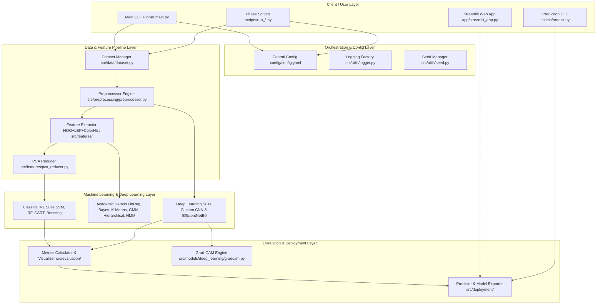
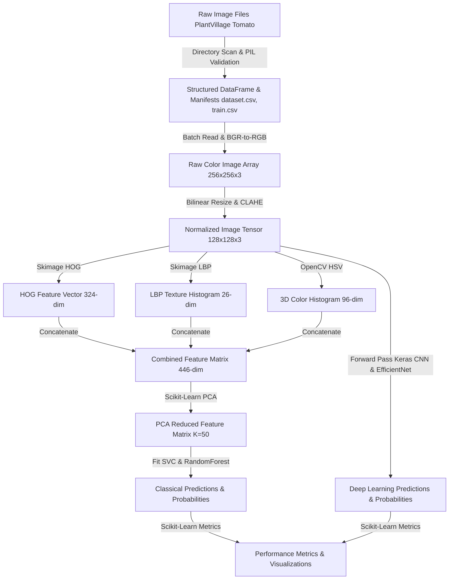
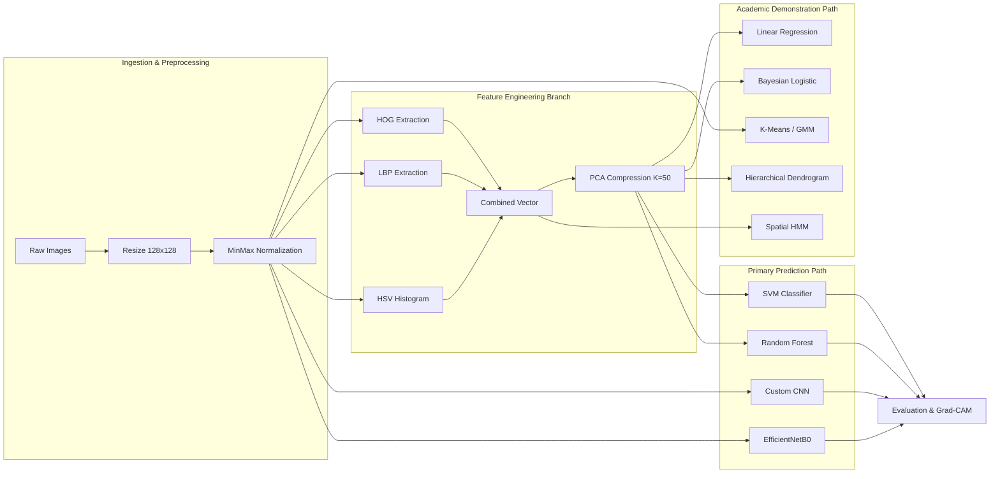
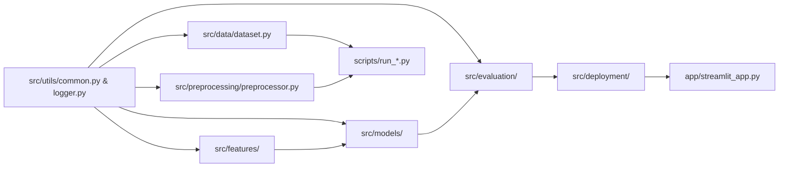
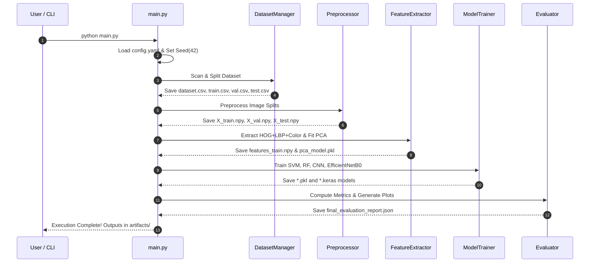

# Architecture Diagrams & Software Specifications
## AI-Based Tomato Leaf Disease Detection System

This document contains the complete visual software architecture, data flow diagrams, pipeline diagrams, module dependency charts, and execution flow charts for the Tomato Leaf Disease Detection system.

---

## 1. System Architecture Diagram

High-level modular architecture showing client interactions, configuration management, data ingestion, feature engineering, model suites, evaluation engine, and deployment interfaces.

---

## 2. Data Flow Diagram (DFD)

Data transformations from raw PlantVillage image files to preprocessed tensors, extracted features, model logits, and final diagnostic classifications.

---

## 3. Complete Processing Pipeline Diagram

Sequential data processing flow demarcating primary classification paths versus academic syllabus demonstration paths.

---

## 4. Module Dependency Diagram

Inter-module code dependencies showing clean separation between data loaders, feature extractors, model implementations, and deployment services.

---

## 5. Execution Flow Diagram

Control flow sequence when executing `main.py` or individual phase scripts.

